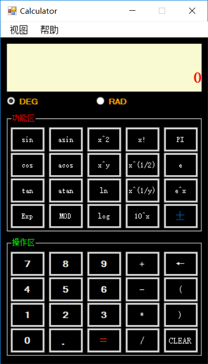

# calculator
This scientific calculator focuses on both correctness and robustness. It modifies the expression for dealing with illegal input. If we press `1+2+*`, the expression will be `(1+2)*`. If we press `1+(2+3+*`, the expression will be `1+((2+3)*`. If we press `1+5sin`, the expression will be `1+sin(5)`. And if we then press `6`, it will further become `1+6`. All these behaviors are consitent with Windows default calculator implementation.

这个C#写的科学计算器模拟了Windows系统内置的科学计算器的功能。对于计算器实现而言，正确性和鲁棒性是最重要的。这个计算器具有表达式修正的功能，举例来说，如果当前的表达式为`1+2+`，此时我们按下乘号`*`，则表达式会被修正为`(1+2)*`；如果我们当前的表达式为`1+(2+3+`，此时我们按下乘号`*`，则表达式会被修正为`1+((2+3)*`；如果当前表达式为`1+5`，我们按下`sin`，则表达式变为`1+sin(5)`，若此时我们再按下`6`，则表达式会被修正为`1+6`。这些都与Windows自带计算器的表达式修正行为一致。

## LICENSE
MIT
